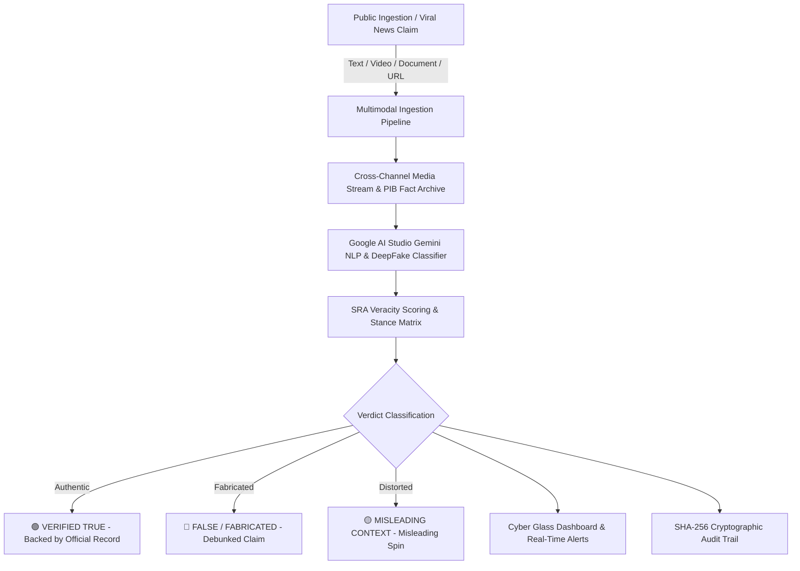

# 📰 SRA TruthGuard — AI-Powered Multimodal News & Claim Verification Platform

[](https://sra-truthguard.pages.dev/)
[](https://chimerical-boba-ea62fe.netlify.app/)
[](https://react.dev/)
[](https://vitejs.dev/)
[](https://aistudio.google.com/)
[](https://supabase.com/)
[](LICENSE)

> **⚡ Cloudflare Pages (Primary):** [https://sra-truthguard.pages.dev/](https://sra-truthguard.pages.dev/)  
> **🌐 Netlify Deployment:** [https://chimerical-boba-ea62fe.netlify.app/](https://chimerical-boba-ea62fe.netlify.app/)  
> **📁 Source Repository:** [https://github.com/zainul7abideen-sudo/News_Verifier](https://github.com/zainul7abideen-sudo/News_Verifier)

---

**SRA TruthGuard** is an institutional, multimodal news verification and claim auditing platform designed to combat misinformation, deepfakes, and viral false claims across digital, broadcast, and print media channels (Television, Social Media, Newspapers, and Radio).

---

## 🌐 Live Deployments & Documentation

- **⚡ Cloudflare Pages Live App:** [https://sra-truthguard.pages.dev/](https://sra-truthguard.pages.dev/)
- **🌐 Netlify Live App:** [https://chimerical-boba-ea62fe.netlify.app/](https://chimerical-boba-ea62fe.netlify.app/)
- **📑 Product Requirement Document (PRD):** [`SRA_TruthGuard_PRD.pdf`](SRA_TruthGuard_PRD.pdf) | [`docs/prd.html`](docs/prd.html)
- **🏗️ System Architecture Specification:** [`SRA_TruthGuard_System_Architecture.pdf`](SRA_TruthGuard_System_Architecture.pdf) | [`docs/architecture.html`](docs/architecture.html)
- **📐 UML Class & Object Diagrams Specification:** [`SRA_TruthGuard_Class_and_Object_Diagrams.pdf`](SRA_TruthGuard_Class_and_Object_Diagrams.pdf) | [`docs/class_and_object_diagrams.html`](docs/class_and_object_diagrams.html)

---

## 🏛️ System Architecture & Workflow



---

## 🌟 Key Features

1. **🤖 Google AI Studio (Gemini Intelligence Engine):**
   - Multimodal fact-checking powered by `gemini-3-flash-preview` and `gemini-3.5-flash`.
   - Automated veracity confidence scoring (0–100%) and sensationalism index detection.
   - Ground-truth validation against official Press Information Bureau (PIB) archives and Government of India gazette records.

2. **🛸 Flagship SRA Cyber Glassmorphic UI:**
   - Obsidian dark theme with neon cyan (`#38bdf8`) and emerald (`#22c55e`) glowing accents.
   - Interactive 7-Day Verification Wave Trend SVG Chart with live data points.
   - Real-time monitored media directory (NDTV, BBC World, CNN, The Hindu, Al Jazeera, Zee News).

3. **🌀 Prominent Quantum Holographic Loaders:**
   - Triple orbital cyber spinner with counter-rotating rings and pulsing CPU core.
   - Dedicated active forensic HUD telemetry banners during claim processing.

4. **📰 Smooth Breaking News Ticker:**
   - Real-time `TRUTH ALERTS` banner with smooth overflow clipping underneath a solid red badge.

5. **📧 Dynamic OTP Email Verification Engine (Official Sender: `zainulcorp71@gmail.com`):**
   - Cryptographically random 6-digit dynamic OTP generated per request for user registration and password recovery.
   - 10-minute expiry with 30-second rate-limiting cooldown.
   - Zero-cost live email inbox delivery via EmailJS & Gmail SMTP integration.
   - Secure manual code entry verification flow (no auto-fill leakage).

6. **🛡️ Dual-Tier Access (Public & Staff Admin Command Center):**
   - **Public Portal:** Instant multi-tab verifier, category filtering, search, and certificate hashing.
   - **Admin Portal:** Live system telemetry, user role management, tickets, and security credentials.

---

## 🚀 Getting Started

### 1. Prerequisites
- **Node.js**: v18.0.0 or higher
- **npm** or **yarn**

### 2. Installation
```bash
# Clone the repository
git clone https://github.com/zainul7abideen-sudo/News_Verifier.git
cd News_Verifier

# Install dependencies
npm install
```

### 3. Environment Variables
Create a `.env` file in the project root:
```env
# Database & Gemini AI Configuration
VITE_SUPABASE_URL=your_supabase_project_url
VITE_SUPABASE_ANON_KEY=your_supabase_anon_key
VITE_GEMINI_API_KEY=your_google_ai_studio_api_key
GEMINI_API_KEY=your_google_ai_studio_api_key
PORT=5000

# EmailJS Dynamic OTP Email Configuration
VITE_EMAILJS_SERVICE_ID=service_tcbxzjq
VITE_EMAILJS_TEMPLATE_ID=template_ebe35xs
VITE_EMAILJS_PUBLIC_KEY=IpvuIpdPsVjRYtrFx
EMAILJS_SERVICE_ID=service_tcbxzjq
EMAILJS_TEMPLATE_ID=template_ebe35xs
EMAILJS_PUBLIC_KEY=IpvuIpdPsVjRYtrFx
EMAILJS_PRIVATE_KEY=xcG-bzRyHIGzFPEeXEIEe
```

### 4. Running Locally
```bash
# Start frontend client (Vite)
npm run dev

# Start AI backend server (optional)
npm run server

# Run backend API test suite
npm run test:backend
```
Open your browser at `http://localhost:5174` (or `http://localhost:5173`).

---

## 🌐 Netlify Deployment

TruthGuard is pre-configured with `netlify.toml` for zero-configuration Netlify builds:
- **Build command:** `npm run build`
- **Publish directory:** `dist`
- **Live Netlify URL:** [https://chimerical-boba-ea62fe.netlify.app/](https://chimerical-boba-ea62fe.netlify.app/)

---

## 📁 Repository Structure

```text
├── backend/              # Express API, Fact-Checking Engine, Ground-Truth DB & Tests
│   ├── engine/           # Gemini NLP classifier & veracity scorer
│   ├── database/         # Local persistent JSON data store
│   ├── routes/           # Auth & claim verification API endpoints
│   ├── services/mailer.js # Dynamic OTP Nodemailer & EmailJS Node dispatcher
│   ├── server.js         # REST API server (Port 5000)
│   └── tests/            # Automated test suite
├── src/
│   ├── App.jsx           # Master Cyber Glass application
│   ├── index.css         # High-tech design system, animations & loaders
│   ├── api.js            # API communication layer
│   ├── otpService.js     # Real-time dynamic OTP generation & EmailJS browser SDK
│   └── gemini.js         # Direct Google AI Studio client
├── docs/                 # HTML PRD and Architecture documents
├── SRA_TruthGuard_PRD.pdf # Generated PDF Product Requirements
├── SRA_TruthGuard_System_Architecture.pdf # Generated PDF Architecture Spec
├── wrangler.jsonc        # Cloudflare Workers & Pages deployment configuration
├── netlify.toml          # Netlify production routing & headers
├── package.json          # Dependencies & scripts
└── README.md             # Project documentation
```

---

## 📄 License
This project is licensed under the MIT License - see the [LICENSE](LICENSE) file for details.

