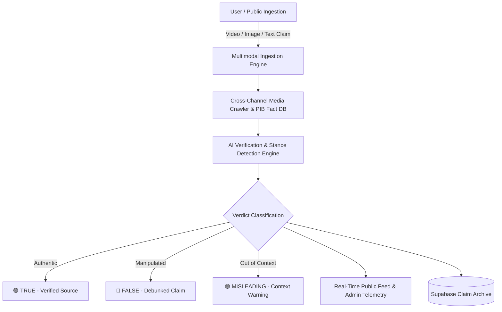

# 📰 SRA Fact Checker — AI-Powered Multimodal News & Claim Verification Platform

[](https://react.dev/)
[](https://vitejs.dev/)
[](https://supabase.com/)
[](LICENSE)

**SRA Fact Checker** is an intelligent, multimodal news verification and claim auditing platform designed to combat misinformation, deepfakes, and viral false claims across digital and print media channels (Television, Social Media, Newspapers, and Radio).

---

## 🏛️ System Architecture & Workflow



---

## 🌟 Key Features

1. **🔍 Multimodal Verification Pipelines:**
   - **Video Fact-Checking**: Timestamped context analysis and deepfake detection.
   - **Image OCR & Reverse Lookup**: Forensic cross-referencing against trusted media archives.
   - **Text Claim Normalization**: Entity extraction and cross-verification with official press bureaus (PIB Fact Check, NDTV, The Hindu).

2. **📊 Dynamic Verdict Classification:**
   - Automated labeling with confidence scores: `True`, `False`, `Misleading`.
   - Category filtering: *National, Technology, Politics, Trending, International*.

3. **👥 Dual-Tier Access (Public & Admin Portal):**
   - **Public Dashboard**: Search trending verified news, submit new verification requests, and track open fact-check tickets.
   - **Admin Command Center**: Real-time moderation, AI verification telemetry logs, ticket resolution, and user management.

4. **⚡ Modern High-Performance Tech Stack:**
   - Ultra-fast client-side routing and rendering with **React 19** and **Vite**.
   - Modular icons with **Lucide React** and responsive slate/dark cyberpunk interface.
   - Cloud persistence with **Supabase Database & Authentication**.

---

## 🚀 Getting Started

### 1. Prerequisites
- **Node.js**: v18.0.0 or higher
- **npm** or **yarn**

### 2. Installation
```bash
# Clone the repository
git clone https://github.com/Zainul9142/SRA-News-Verification-Platform.git
cd SRA-News-Verification-Platform

# Install dependencies
npm install
```

### 3. Environment Variables (Optional)
Create a `.env` file in the root directory:
```env
VITE_SUPABASE_URL=your_supabase_project_url
VITE_SUPABASE_ANON_KEY=your_supabase_anon_key
```

### 4. Start Development Server
```bash
npm run dev
```
Open your browser at `http://localhost:5173`.

### 5. Build for Production
```bash
npm run build
```

---

## 📁 Repository Structure

```text
├── src/
│   ├── assets/           # Media assets and icons
│   ├── App.css           # Custom UI styles and transitions
│   ├── App.jsx           # Main application engine & state router
│   ├── index.css         # Global Tailwind / design tokens
│   ├── main.jsx          # React DOM entrypoint
│   └── supabase.js       # Supabase client integration
├── public/               # Static assets
├── index.html            # HTML5 shell
├── netlify.toml          # Netlify automated deployment configuration
├── package.json          # Dependencies and scripts
├── vite.config.js        # Vite bundler configuration
└── README.md             # Project documentation
```

---

## 👨‍💻 Author
- **Zainul Abideen** - [GitHub Profile](https://github.com/Zainul9142)

## 📄 License
This project is licensed under the MIT License - see the [LICENSE](LICENSE) file for details.
